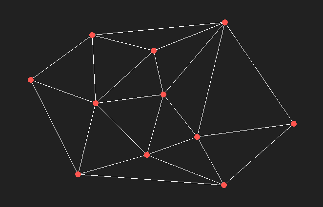

# Delaunay_BowyerWatson

Application that computes the Delaunay triangulation for a set of points in 2D using Bowyer Watson algorithm.

Functionality:
-	Add point (left click)
-	Add point by coordinate
-	Delete point (right click)
-	Show/hide Voronoi diagram (press V)
-	Show/hide triangulation edges (press T)
-	Show/hide triangles circumference (press P)
-	Import points
-	Clear window
-	Inverse color (Light mode/Dark mode)

By:
Mazur Daniela
Trubca Dmitri
Ursu Nicolae
Danilescu Alexandru
